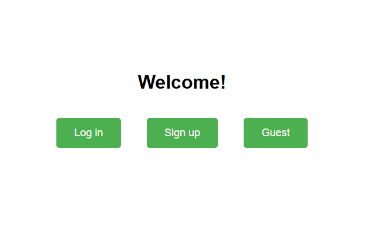
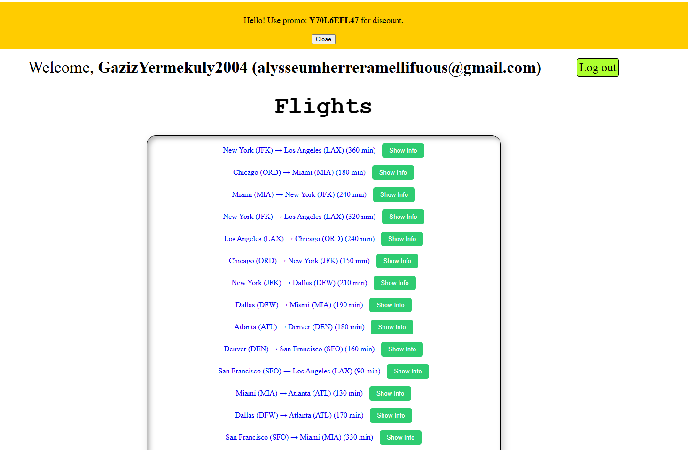
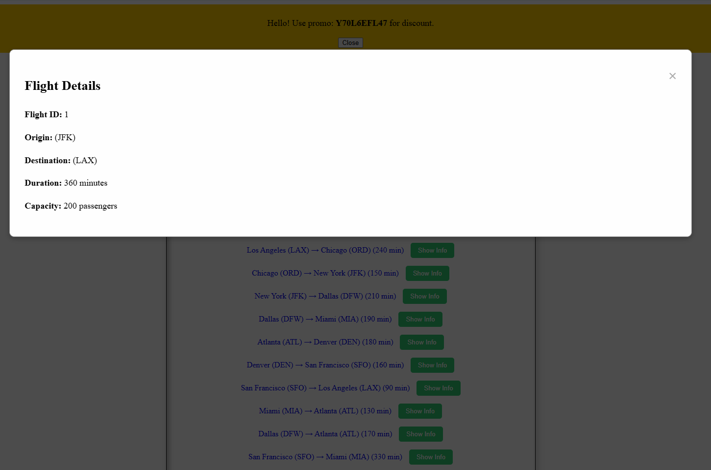
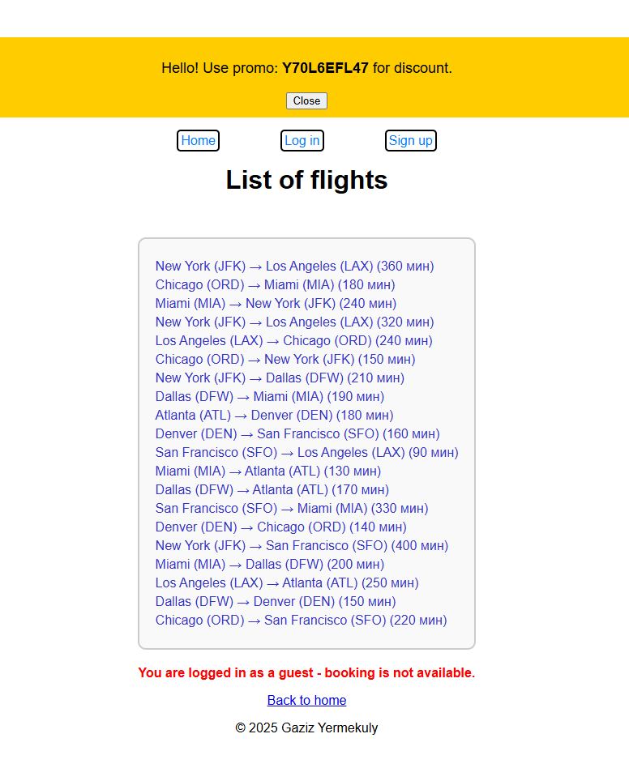

# ✈️ Flight Booker — Django приложение для бронирования авиаперелётов

**Flight Booker** — это полноценная система бронирования авиабилетов, созданная на Django. Пользователь может зарегистрироваться, выбрать нужный рейс, забронировать место (если оно есть), получить промокод, а также управлять своими бронированиями через личный кабинет.

---

## 🚀 Основные функции

- 👤 Регистрация, вход и работа как гость (гостевой доступ без бронирования)
- 🔍 Просмотр всех доступных авиарейсов
- 📆 Бронирование мест на рейс (если они доступны)
- 🔒 Привязка брони к email и генерация кода бронирования
- 🎁 Промокод со скидкой для новых пользователей
- 🗂️ Хранение всех данных (пользователей, рейсов, бронирований) в базе данных

---

## 📄 Описание интерфейса

### 🏠 Приветственная страница

Пользователя встречает экран с тремя кнопками:

- **Login** — вход для зарегистрированных
- **Sign up** — регистрация нового пользователя
- **Guest** — демо-доступ без возможности бронировать

<h3>🏠 Приветственная страница</h3>


---

### 📃 Список рейсов

Здесь отображаются все доступные перелёты, включая дату, направление, цену и количество оставшихся мест.

<h3>🛫 Список перелётов</h3>


---

### 📃 Информация рейсов

Здесь отображаются все доступные перелёты, включая дату, направление, цену и количество оставшихся мест.

<h3>🛫 Список перелётов</h3>


---

### 📩 Страница бронирования

Пользователь может выбрать рейс и забронировать его. Если мест нет — кнопка будет неактивной. После бронирования отображается **уникальный код**, связанный с его email.

<h3>🧾 Страница бронирования</h3>


---

### 🎟️ Гостевая страница

При регистрации новый пользователь получает промокод, который можно применить для скидки на бронирование.

<h3>Гостевая страница</h3>


---

## 🧰 Технологии

- **Python 3.x**
- **Django** (бэкенд и шаблоны)
- **SQLite/PostgreSQL** (БД)
- **HTML/CSS/Bootstrap** — оформление интерфейса
- **JavaScript** — динамические элементы (если есть)
- **Django forms & models** — обработка логики регистрации и бронирования

---

## ⚙️ Установка проекта

### 🔽 1. Клонируй репозиторий:

```bash
git clone https://github.com/HayaKawaRin/Django_airline_system.git
cd Django_airline_system
